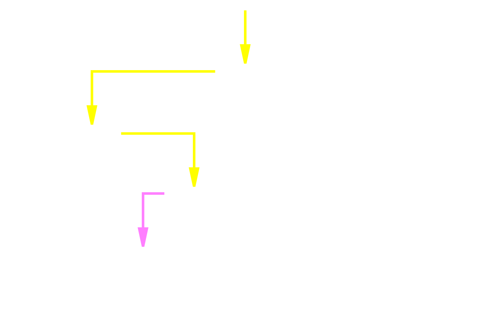

name: inverse
layout: true
class: center, middle
---
# Scraping basics <i class="fa fa-search fa-fw"></i>
## Everything you always wanted to know about scraping but had no <i class="fa fa-futbol-o"></i> to ask. 
.footnote[<i class="fa fa-pencil fa-fw"></i> Created by [nemanjan00](https://github.com/nemanjan00/)]
---
# Scraping basics <i class="fa fa-search fa-fw"></i>
## What I think you should do since I think I am smarter than you. 
.footnote[<i class="fa fa-pencil fa-fw"></i> Created by [nemanjan00](https://github.com/nemanjan00/)]
---
layout: false
### Who am I? <i class="fa fa-user fa-fw"></i> 

 * Web developer

 * Hacker

 * Cool 😎

 * Narcisistic person

 * I do not f\*cking curse

---

### What is the best way for scraping? <i class="fa fa-trophy fa-fw"></i> 

 * What is best solution for specific case? 

 * What do you know the best? 

 * Something in between! 

---

### What this talk is not about? 

 * Scraping frameworks (most of which are very slow)

 * Every single way you can scrap something

 * Theoretical talk

---

### What is this talk about? 

 * Web scraping

 * Technology you are going to have to deal with

 * Tools for understanding what you are dealing with

 * Ways for scraping that turned out to be working for me

 * Discussion about which solution is working for which problem

 * Bonus: Android application reversing

 * Bonus: SWF application reversing

 * Bonus: Sniffing HTTP/HTTPS

---

### How does data get to your browser

 * Initial HTML

 * HTTP Request (AJAX)

 * WebSockets

 * Local storage (LocalStorage, IndexedDB, WebSQL...)

---

### Where can I see initial HTML? 

 * Go to page

 * Press Ctrl + U (chrome) / Type "view-source:" before address (firefox)

---

### HTTP requests from JavaScript / forms? 

 * Can be sniffed using Chrome Developer Tools

  * Ctrl + Shift + i

  * Network tab

  * Disable cache

  * Enable "Preserve log" (only for forms)

  * Pick XHR filter (only for JS requests)

  * Trigger request

---

### Websockets

 * Websock = Socket (Full Duplex, Persistant) over HTTP

 * Can be sniffed using Chrome Developer Tools

  * Ctrl + Shift + i

  * Network tab

  * Disable cache

  * Pick WS filter

  * Refresh page

  * Pick websocket

 * Easiest to scrape using Asynchronous Languages

---

### Local storage

 * You can just delete all content from local storage and figure our how it is filled

 * You can read local storage from browser profile

---

### HTML parsing

 * Do not use parsers

```php
$items = [];

$lists = explode("<ul>", $data); // Split by opening tag
$list = $lists[1]; // Take first one. Index 0 is for stuff before tag... 

$listItems = explode("<li>", $list); // Split again by another tag

unset($listItems[0]); // Delete stuff before first tag

forEach($listItems as $item){
	$item = explode("<", $item)[0]; // Get something from tag

	$items[] = $item; // Add it to array
}
```
---

### Unpredictable scraping path && no branching

* Synchronous languages (PHP in my case)

#### Pros

 * Easier to write

 * No too much need for nesting

 * Not too aggressive when it comes to traffic (slow by default)

#### Cons

 * Slow for branching. 

 * You touch it, you buy it. 

.footnote[[Example](https://github.com/nemanjan00/scraping/tree/master/example1) and [scraper](https://github.com/nemanjan00/scraping/tree/master/example1-scraper)]
---

### Predictable scraping path || a lot of branching 

* Asynchronous languages (Node.JS in my case)

#### Pros

 * Crazy fast

 * Simpler to scale

 * Powerful error handling

#### Cons

 * Can be too fast

 * Sometimes hard to track status

.footnote[[Example](https://github.com/nemanjan00/scraping/tree/master/example2) and [scraper](https://github.com/nemanjan00/scraping/tree/master/example2-scraper)]

---

### Keep calm and fuzz input

 * Two golden rules

  * Try to manipulate very single input

  * If it works without non-crucial input, remove it

---

### HTTP headers

 * Content-Length - Length of POST payload (update/remove this if server never responds or invalid request)

 * User-Agent - Information about browser

 * Accept-Encoding:gzip - This is what makes server compress response

 * Content-Type - This tells server what payload is

 * Connection:Keep-Alive - Server will respond to this with Connection header. If server responds with Keep-Alive, you can abuse this to use one connection for multiple requests

 * Authorization: This one is obvious

---

### Cookie storage

#### PHP

 * Cookiejar (with curl)

#### Node.JS

 * [tough-cookie](https://github.com/salesforce/tough-cookie)

 * [Reading browser cookies](https://github.com/combistack/chrome/blob/master/cookies/site.js)

---

### Binary search

 * Sometimes you need to guess page number/last id/whatewer.

 * Multiply input by 10, until you get error

 * Do binary search from 0 to current input



---

### Anti antiscraping

 * KISS (keep it simple, stupid)

 * Focus on detecting errors instead of preventing them

 * Retry

 * Example: Write code so that it takes list of proxies, takes random one for each request and in case of error retries it until it gets correct result. 

 * Detect error by checking if expected content is on page. 200 is not always good sign. 

 * Make sure you have TTL

---

### Uglified JavaScript

 * [js-beautify](https://www.npmjs.com/package/js-beautify)

```bash
sudo npm install -g js-beautify
js-beautify -f file.js -o output.js
```

---

### Webpack

---

### Getting Android application source code (almost)

---

### Getting SWF application source code (almost)

---

### Sniffing HTTP/HTTPS

---
layout: true
class: center, middle
---

# Now ask questions or/and go away
## nemanjan00@gmail.com

